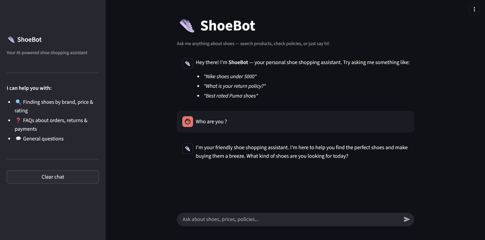
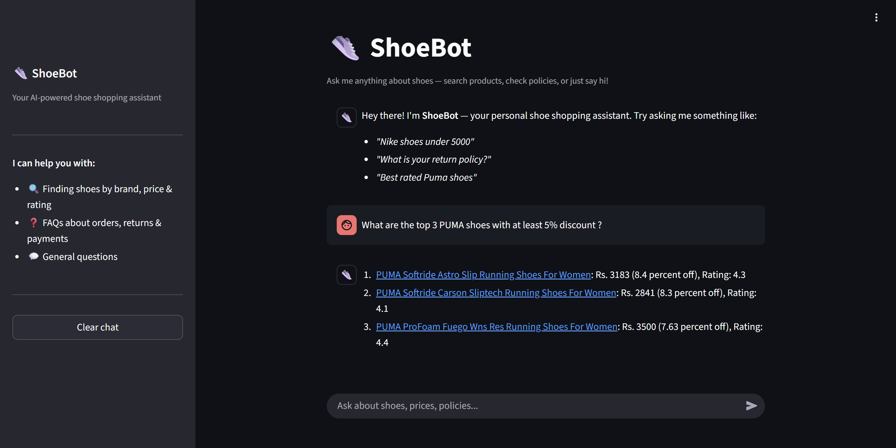
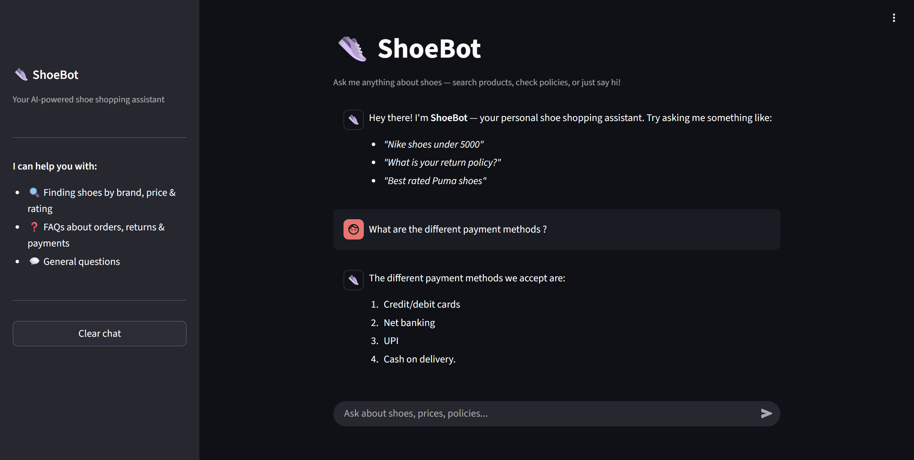

# ShoeBot - E-Commerce Chatbot

An AI-powered shoe shopping assistant built with Streamlit. It uses semantic routing to handle product searches, FAQs, and small talk through a conversational interface.

## Live Demo

[Try ShoeBot](<!-- Add your deployed URL here -->)

## Screenshots

| Chat Interface | Product Search |
|:-:|:-:|
|  |  |

| FAQ | Sidebar |
|:-:|:-:|
|  |  |

## Architecture

The chatbot uses a **semantic router** to classify user queries into three categories:

- **Product Search (SQL)** - Queries about shoes (brand, price, rating, discount) are converted to SQL via an LLM, executed against a SQLite database, and the results are summarized in natural language.
- **FAQ** - Policy and support questions are matched against a FAQ knowledge base stored in ChromaDB, then answered using RAG.
- **Small Talk** - General conversation (greetings, identity questions) is handled directly by an LLM.

## Tech Stack

- **UI**: Streamlit
- **LLM**: Groq (LLaMA 3.3 70B)
- **Routing**: Semantic Router with HuggingFace embeddings (`all-MiniLM-L6-v2`)
- **Vector DB**: ChromaDB (FAQ retrieval)
- **Database**: SQLite (product catalog)
- **Data Source**: [Flipkart](https://www.flipkart.com/) (web-scraped)

## Project Structure

```
app/
  main.py          # Streamlit UI and routing logic
  router.py        # Semantic route definitions
  sql.py           # Natural language to SQL pipeline
  faq.py           # FAQ retrieval and answering (RAG)
  smalltalk.py     # Small talk handler
  resources/
    faq_data.csv   # FAQ knowledge base
  db.sqlite        # Product database
web-scrapping/
  flipkart_data_extraction.ipynb   # Data scraping notebook
  csv_to_sqlite.py                 # CSV to SQLite converter
```

## Setup

1. Install dependencies:
   ```bash
   pip install -r requirements.txt
   ```

2. Create `app/.env` with your Groq API key:
   ```
   GROQ_API_KEY=your_api_key_here
   GROQ_MODEL=llama-3.3-70b-versatile
   ```

3. Run the app:
   ```bash
   cd app
   streamlit run main.py
   ```
